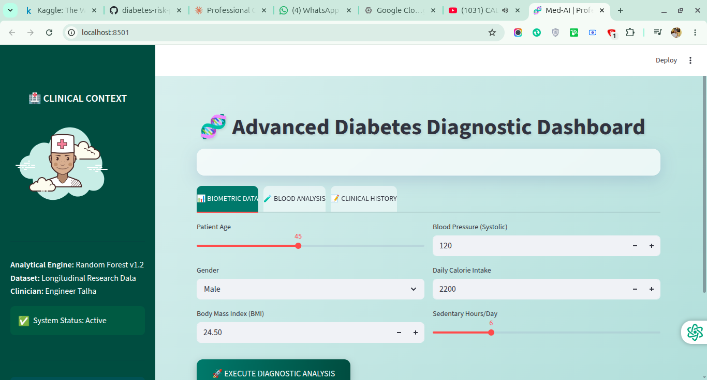
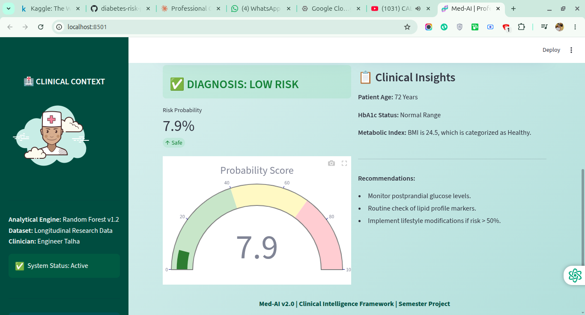

<div align="center">


# 🧬 Med-AI: Type 2 Diabetes Risk Prediction System

### Clinical-Grade Machine Learning · Streamlit Web App · Random Forest Ensemble

[](https://python.org)
[](https://streamlit.io)
[](https://scikit-learn.org)
[](LICENSE)
[](https://github.com/httpstalha/diabetes-risk-predictor/stargazers)

**An advanced, end-to-end clinical AI system that predicts Type 2 Diabetes risk in real-time using 30 biomarkers — powered by Random Forest and deployed via a glassmorphism Streamlit dashboard.**

</div>

---

## 📌 Table of Contents

- [About The Project](#-about-the-project)
- [Key Features](#-key-features)
- [Tech Stack](#-tech-stack)
- [Project Structure](#-project-structure)
- [Model Performance](#-model-performance)
- [Setup & Installation](#-setup--installation)
- [How It Works](#-how-it-works)
- [Screenshots](#-screenshots)
- [Contributing](#-contributing)
- [Author](#-author)

---

## 🔬 About The Project

> **"Early detection saves lives."**

Diabetes affects **537 million adults globally** (IDF, 2025), yet a large percentage go undiagnosed until complications arise. This project bridges the gap between raw clinical data and actionable medical insight.

**Med-AI** is an applied ML project that trains a **Random Forest Ensemble** on a research-grade longitudinal dataset and deploys it as an interactive web application. Clinicians or researchers can input 30 clinical biomarkers and receive an **instant probability score** along with personalized medical insights.

This project is designed for:
- 🎓 **Students** learning applied machine learning in healthcare
- 🏥 **Researchers** prototyping clinical decision-support tools
- 💼 **Developers** exploring Streamlit deployment with ML pipelines

---

## ✨ Key Features

| Feature | Description |
|--------|-------------|
| 🧠 **ML Pipeline** | End-to-end `scikit-learn` pipeline with preprocessing + Random Forest model |
| 📊 **30 Clinical Features** | Biometric, biochemical, lifestyle, and historical data inputs |
| 🌡️ **Risk Gauge Chart** | Animated Plotly gauge showing real-time diabetes probability score |
| 💊 **Medical Insights** | Auto-generated patient-specific clinical recommendations |
| 🎨 **Glassmorphism UI** | Premium teal-themed Streamlit interface with custom CSS |
| 🚀 **One-Command Launch** | Instantly runnable with `streamlit run app.py` |
| 📁 **Pre-trained Models** | `.joblib` models included — no retraining required |

---

## 🛠️ Tech Stack

**Machine Learning:**
- `scikit-learn` — Random Forest Classifier, preprocessing pipeline
- `pandas` & `numpy` — Data manipulation
- `joblib` — Model serialization

**Web App:**
- `Streamlit` — Frontend framework
- `Plotly` — Interactive gauge charts
- Custom CSS (Glassmorphism design)

**Data:**
- Research-grade longitudinal Type 2 Diabetes dataset (v3)
- 30 clinical features: HbA1c, HOMA-IR, Triglycerides, BMI, Glucose, and more

---

## 📂 Project Structure

```
diabetes-risk-predictor/
│
├── 📓 Diabetes_Prediction.ipynb   # Full EDA, feature engineering & model training
├── 🖥️  app.py                      # Streamlit web application
│
├── 📁 data/
│   └── research_grade_type2_diabetes_dataset_v3.csv
│
├── 📁 models/
│   ├── diabetes_model.joblib      # Trained Random Forest model
│   └── preprocessor.joblib        # Fitted preprocessing pipeline
│
├── 📄 requirements.txt
└── 📄 README.md
```

---

## 📈 Model Performance

The Random Forest model was trained on a research-grade clinical dataset.

> 📓 **See `Diabetes_Prediction.ipynb`** for full evaluation metrics, confusion matrix, ROC curve, and feature importance plots.

**Top Predictive Features:**
1. 🩸 HbA1c Level
2. 📊 HOMA-IR Score
3. 🍬 Fasting Glucose
4. ⚖️ Body Mass Index (BMI)
5. 🧬 Family History of Diabetes

---

## ⚙️ Setup & Installation

### Prerequisites
- Python 3.9 or higher
- pip package manager

### Step 1: Clone the Repository
```bash
git clone https://github.com/httpstalha/diabetes-risk-predictor.git
cd diabetes-risk-predictor
```

### Step 2: Install Dependencies
```bash
pip install -r requirements.txt
```

### Step 3: Launch the App
```bash
streamlit run app.py
```

The app will open automatically at `http://localhost:8501` 🎉

---

### 🔁 Optional: Retrain the Model

Open and run all cells in `Diabetes_Prediction.ipynb` to regenerate the `.joblib` model files from scratch.

---

## 🧠 How It Works

```
User Input (30 clinical features)
        ↓
Streamlit UI — 3 Tabs: Biometric · Blood Analysis · Clinical History
        ↓
preprocessor.joblib  →  StandardScaler + Encoding
        ↓
diabetes_model.joblib  →  Random Forest Ensemble
        ↓
Risk Score (0–100%) + Category (High Risk / Low Risk)
        ↓
Plotly Gauge Chart + Personalized Medical Recommendations
```

**Input Categories:**

| Category | Features |
|----------|----------|
| 🏃 Biometric | Age, Gender, BMI, Blood Pressure, Sedentary Hours, Daily Calorie Intake |
| 🧪 Blood Analysis | HbA1c, Fasting Glucose, Insulin, HOMA-IR, Triglycerides, LDL |
| 📋 Clinical History | Family History, Medication, Smoking, Alcohol, Physical Activity, Sleep |

---

## 🖼️ Screenshots

### 📊 Input Dashboard — Biometric Data Tab



### ✅ Diagnosis Output — Risk Score & Clinical Insights



---

## 🤝 Contributing

Contributions are welcome! If you have ideas to improve model accuracy, add new features, or enhance the UI:

1. Fork the repository
2. Create your feature branch: `git checkout -b feature/AmazingFeature`
3. Commit your changes: `git commit -m 'Add AmazingFeature'`
4. Push to branch: `git push origin feature/AmazingFeature`
5. Open a Pull Request

---

## 📄 License

Distributed under the MIT License. See `LICENSE` for more information.

---

## 👨‍💻 Author

**Engineer Talha**
*Clinical Intelligence Systems — Semester Project*

[](https://github.com/httpstalha)

---

<div align="center">

⭐ **Agar yeh project aapke kaam aaya, toh Star zaroor dein!** ⭐

*Built with ❤️ for clinical AI research*

**Med-AI v2.0 | Clinical Intelligence Framework**

</div>
